# Architecture Documentation

## Table of Contents

1. [Overview](#overview)
2. [System Architecture](#system-architecture)
3. [Component Architecture](#component-architecture)
4. [Authentication Flow](#authentication-flow)
5. [Message Flow Sequence](#message-flow-sequence)
6. [Error Handling Architecture](#error-handling-architecture)
7. [Circuit Breaker Pattern](#circuit-breaker-pattern)
8. [Session Management](#session-management)
9. [Transport Modes](#transport-modes)
10. [Data Flow](#data-flow)

---

## Overview

The Copilot Studio Agent Direct Line MCP Server is a bridge between MCP clients (like VS Code) and Microsoft Copilot Studio Agents via the Direct Line 3.0 API. It supports two transport modes (stdio and HTTP) with optional OAuth authentication for production deployments.

### Key Design Principles

- **Thin Abstraction Layer**: Minimal logic between MCP clients and Direct Line API
- **Resilient**: Circuit breaker, retry logic, and comprehensive error handling
- **Secure**: OAuth authentication, session management, and secret masking
- **Scalable**: Multi-user support with conversation isolation
- **Observable**: Comprehensive logging, metrics, and audit trails

---

## System Architecture

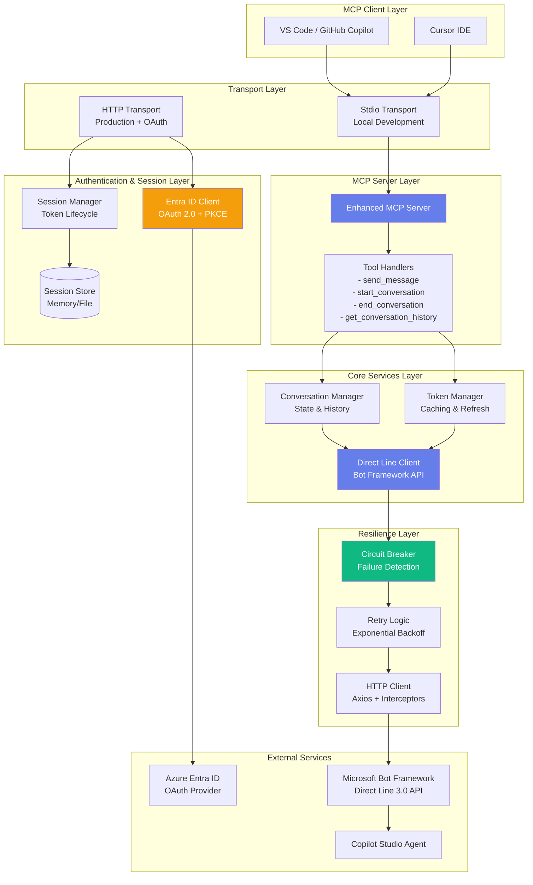

---

## Component Architecture

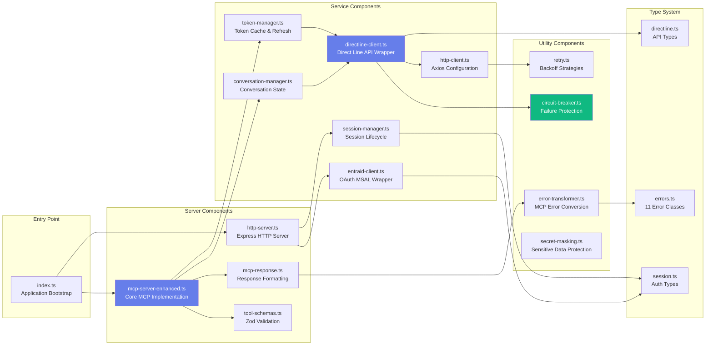

---

## Authentication Flow

### HTTP Mode with OAuth 2.0 + PKCE

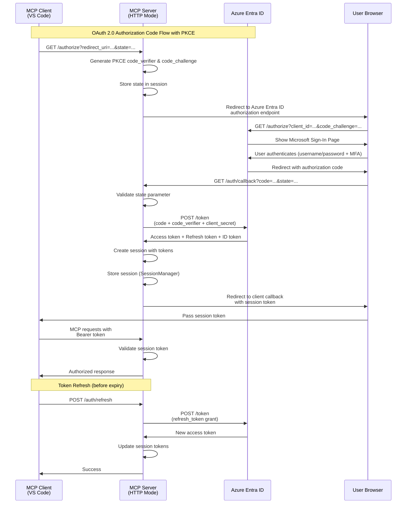

### Stdio Mode (No Authentication)

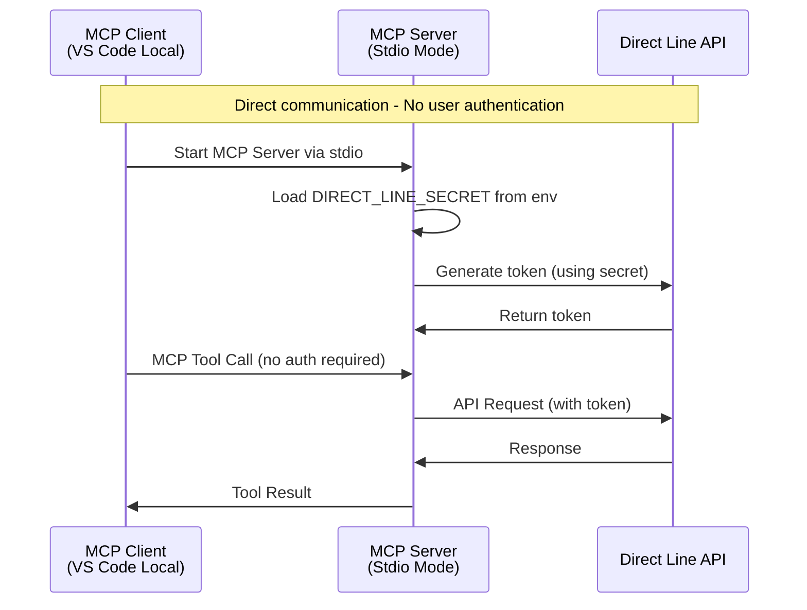

---

## Message Flow Sequence

### Complete Conversation Flow

```mermaid
sequenceDiagram
    participant User as GitHub Copilot<br/>(MCP Client)
    participant MCP as MCP Server<br/>Enhanced
    participant Token as Token Manager
    participant Conv as Conversation<br/>Manager
    participant CB as Circuit Breaker
    participant DL as Direct Line<br/>Client
    participant Bot as Copilot Studio<br/>Agent
    
    Note over User,Bot: 1. Start Conversation
    User->>MCP: start_conversation(initialMessage)
    MCP->>Token: getToken(clientId)
    
    alt Token Cached
        Token->>Token: Check cache validity
        Token-->>MCP: Return cached token
    else Token Expired/Missing
        Token->>DL: generateToken()
        DL->>CB: Execute with circuit breaker
        CB->>Bot: POST /tokens/generate
        Bot-->>CB: Token response
        CB-->>DL: Success
        DL-->>Token: Token data
        Token->>Token: Cache token + schedule refresh
        Token-->>MCP: New token
    end
    
    MCP->>Conv: createConversation(clientId, token)
    Conv->>DL: startConversation(token)
    DL->>CB: Execute with circuit breaker
    CB->>Bot: POST /conversations
    Bot-->>CB: Conversation created
    CB-->>DL: Success
    DL-->>Conv: Conversation details
    Conv->>Conv: Store conversation state<br/>(id, token, clientId, watermark)
    Conv->>Conv: Schedule idle timeout cleanup (30 min)
    Conv-->>MCP: Conversation state
    
    alt Initial Message Provided
        MCP->>DL: sendActivity(conversationId, message, token)
        DL->>CB: Execute with circuit breaker
        CB->>Bot: POST /conversations/{id}/activities
        Bot-->>CB: Activity ID
        CB-->>DL: Success
        DL-->>MCP: Activity ID
        
        MCP->>MCP: Poll for bot response (30s timeout)
        loop Every 1 second (max 30 iterations)
            MCP->>DL: getActivities(conversationId, watermark, token)
            DL->>CB: Execute with circuit breaker
            CB->>Bot: GET /conversations/{id}/activities
            Bot-->>CB: Activity set
            CB-->>DL: Success
            DL-->>MCP: Activities + watermark
            MCP->>Conv: updateWatermark(conversationId, watermark)
            
            alt Bot Response Found
                MCP->>Conv: addToHistory(conversationId, activities)
                MCP->>MCP: Extract bot message
                MCP-->>User: Conversation + Response
            else No Response Yet
                MCP->>MCP: Wait 1 second, continue polling
            end
        end
    else No Initial Message
        MCP-->>User: Conversation started (no message)
    end
    
    Note over User,Bot: 2. Send Message
    User->>MCP: send_message(message, conversationId)
    MCP->>Conv: getConversation(conversationId)
    Conv->>Conv: Validate conversation exists
    Conv->>Conv: Update lastActivity timestamp
    Conv->>Conv: Reschedule idle timeout
    Conv-->>MCP: Conversation state
    
    MCP->>DL: sendActivity(conversationId, message, token)
    DL->>CB: Execute with circuit breaker
    
    alt Circuit Breaker CLOSED
        CB->>Bot: POST /conversations/{id}/activities
        Bot-->>CB: Activity ID
        CB->>CB: Record success
        CB-->>DL: Success
    else Circuit Breaker OPEN
        CB-->>DL: Fail fast (CircuitBreakerError)
        DL-->>MCP: Error
        MCP->>MCP: Transform to MCP error
        MCP-->>User: Error response
    end
    
    DL-->>MCP: Activity ID
    
    Note over MCP: Poll for bot response
    MCP->>DL: getActivities(conversationId, watermark, token)
    DL->>CB: Execute with circuit breaker
    CB->>Bot: GET /conversations/{id}/activities
    Bot-->>CB: Activity set with bot responses
    CB-->>DL: Success
    DL-->>MCP: Activities
    MCP->>Conv: updateWatermark + addToHistory
    MCP->>MCP: Extract bot message
    MCP-->>User: Message sent + Bot response
    
    Note over User,Bot: 3. Get Conversation History
    User->>MCP: get_conversation_history(conversationId, limit)
    MCP->>Conv: getConversation(conversationId)
    Conv-->>MCP: Conversation state
    MCP->>MCP: Format message history (apply limit)
    MCP-->>User: Message history array
    
    Note over User,Bot: 4. End Conversation
    User->>MCP: end_conversation(conversationId)
    MCP->>Conv: endConversation(conversationId)
    Conv->>Conv: Clear idle timeout timer
    Conv->>Conv: Delete conversation state
    Conv->>Conv: Update metrics
    Conv-->>MCP: Cleanup complete
    MCP-->>User: Conversation ended
```

---

## Error Handling Architecture

### Error Hierarchy and Flow

```mermaid
graph TD
    subgraph "Error Classification"
        BaseError[ApplicationError<br/>Base Error Class]
        
        AuthErr[AuthenticationError<br/>401 Unauthorized]
        AuthzErr[AuthorizationError<br/>403 Forbidden]
        OAuthErr[OAuthError<br/>OAuth Failures]
        TokenErr[TokenRefreshError<br/>Token Renewal Failed]
        
        NetErr[NetworkError<br/>ECONNRESET, ETIMEDOUT]
        TimeoutErr[TimeoutError<br/>Request Timeout]
        RateLimitErr[RateLimitError<br/>429 Rate Limit]
        ServiceErr[ServiceUnavailableError<br/>503 Service Down]
        
        CBErr[CircuitBreakerError<br/>Circuit Open]
        ConfigErr[ConfigurationError<br/>Config Issues]
        ValidationErr[ValidationError<br/>Invalid Input]
        
        BaseError --> AuthErr
        BaseError --> AuthzErr
        BaseError --> OAuthErr
        BaseError --> TokenErr
        BaseError --> NetErr
        BaseError --> TimeoutErr
        BaseError --> RateLimitErr
        BaseError --> ServiceErr
        BaseError --> CBErr
        BaseError --> ConfigErr
        BaseError --> ValidationErr
    end
    
    subgraph "Error Context"
        Context[Error Context<br/>category, severity, retryable]
        RetryStrategy[Retry Strategy<br/>maxRetries, delays, backoff]
        UserMessage[User-Friendly Message]
        RecoveryAction[Recovery Action]
        Metadata[Additional Metadata]
        
        Context --> RetryStrategy
        Context --> UserMessage
        Context --> RecoveryAction
        Context --> Metadata
    end
    
    subgraph "Error Transformation"
        MCPError[MCP Error Format<br/>code, message, data]
        ErrorTransformer[Error Transformer<br/>converts to MCP]
    end
    
    BaseError --> Context
    BaseError --> ErrorTransformer
    ErrorTransformer --> MCPError
    
    style BaseError fill:#dc3545,color:#fff
    style OAuthErr fill:#f59e0b,color:#fff
    style NetErr fill:#f59e0b,color:#fff
    style CBErr fill:#dc3545,color:#fff
    style MCPError fill:#667eea,color:#fff
```

### Error Handling Flow

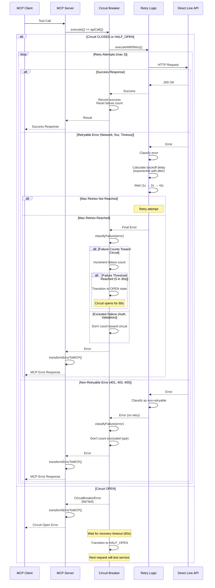

---

## Circuit Breaker Pattern

### State Machine

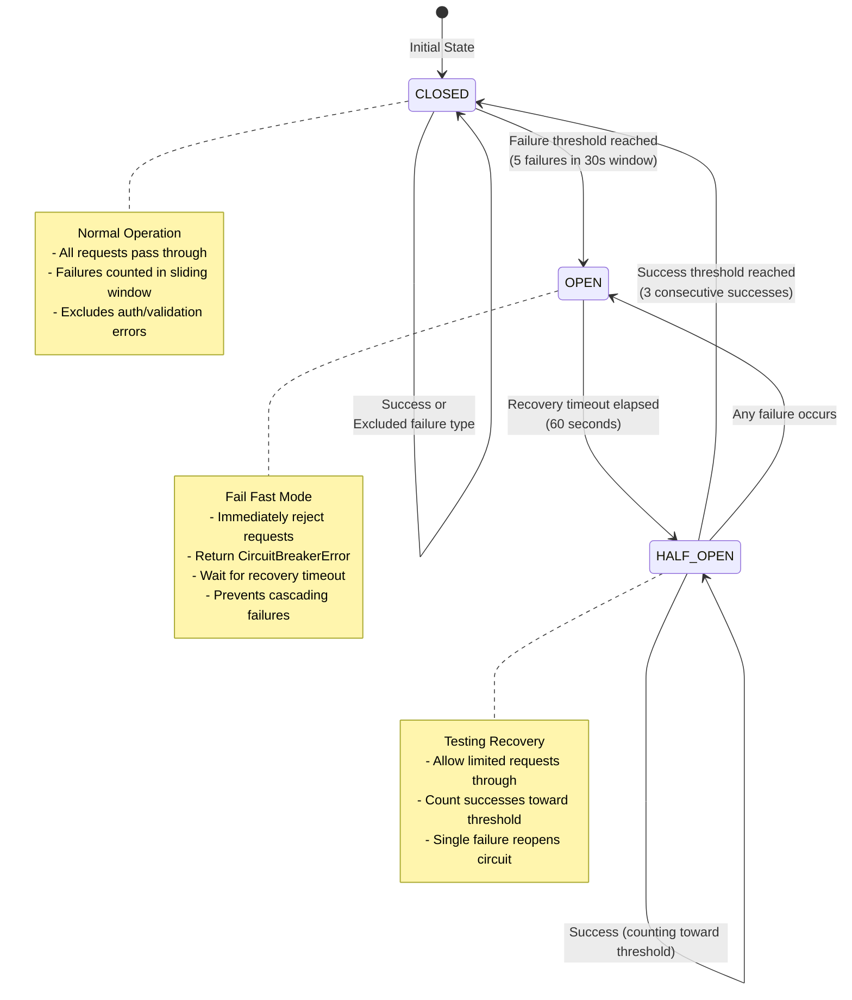

### Failure Classification

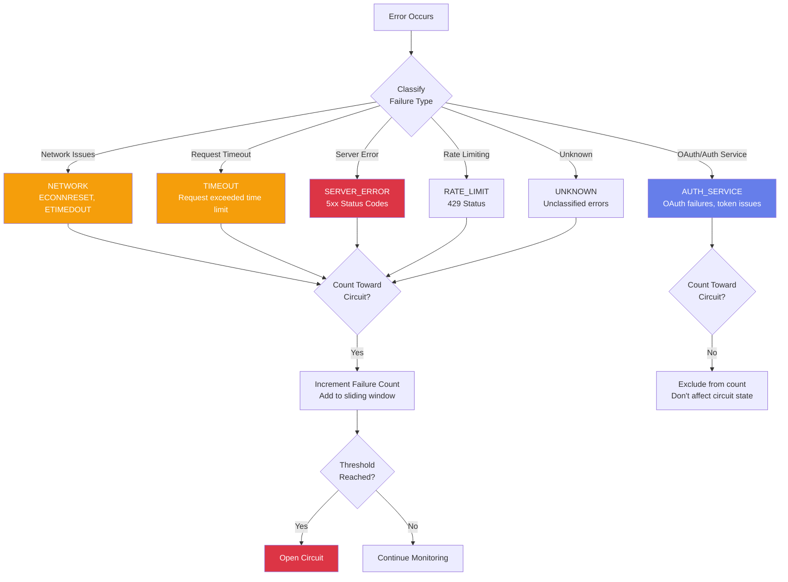

---

## Session Management

### Session Lifecycle (HTTP Mode)

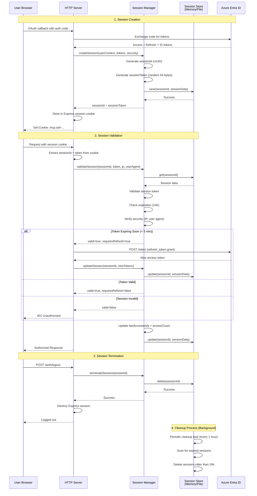

### Session Store Types

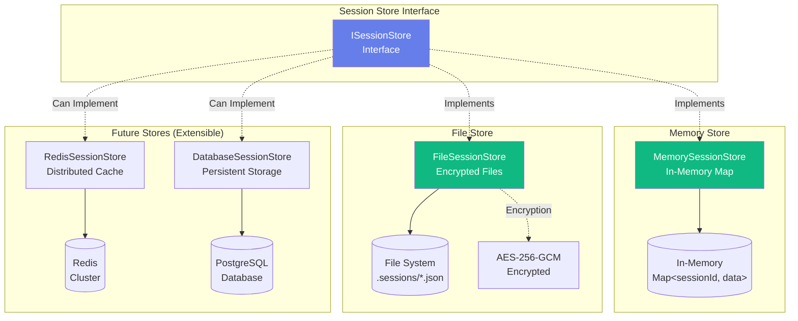

---

## Transport Modes

### Stdio Transport (Local Development)

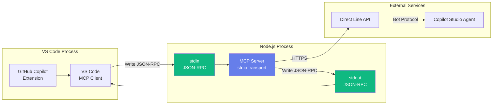

### HTTP Transport (Production)

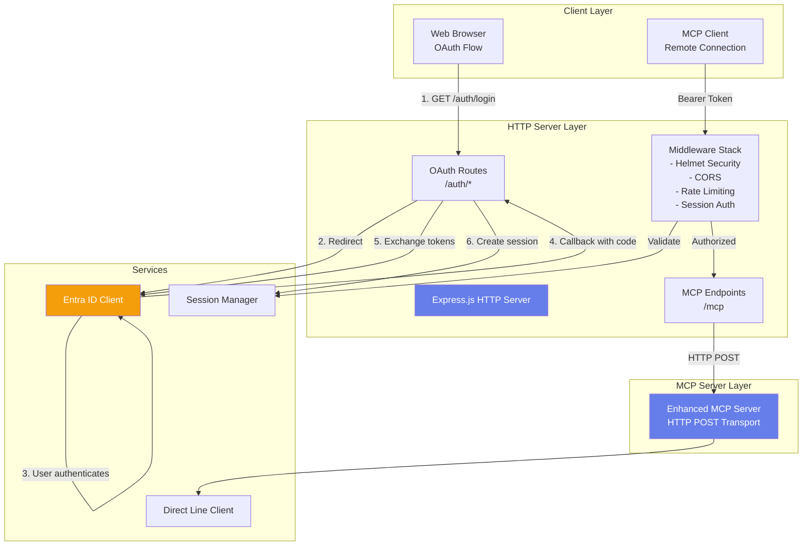

---

## Data Flow

### Token Management Flow

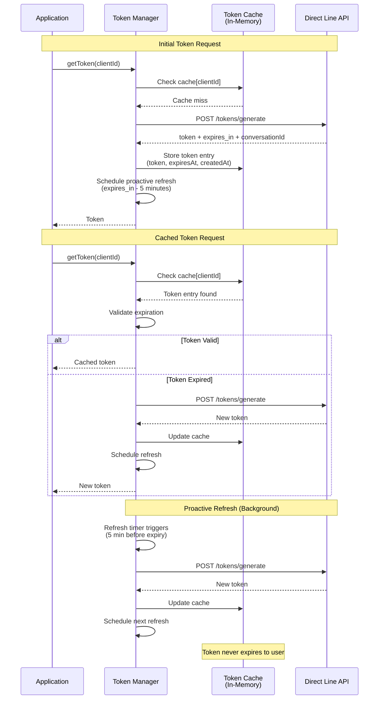

### Conversation State Management

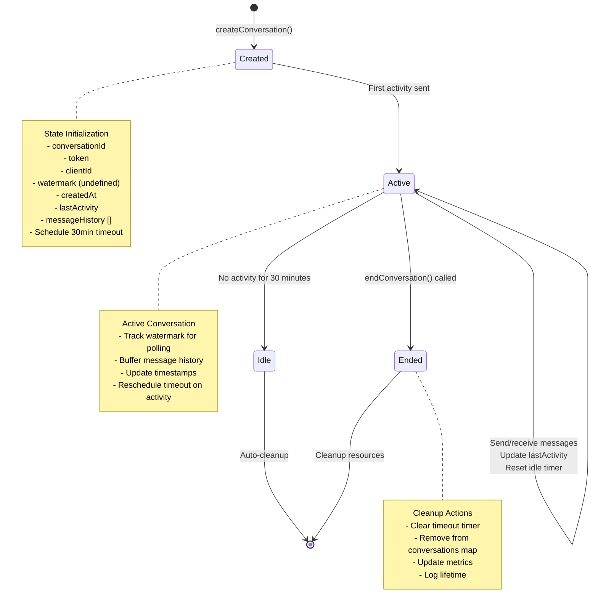

### Message Polling Strategy

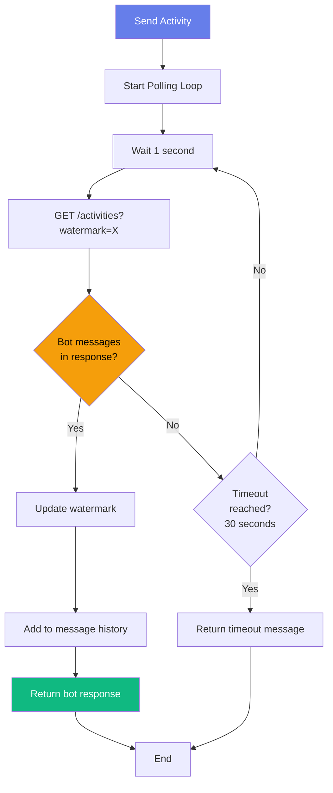

---

## Additional Diagrams

### Retry Strategy with Exponential Backoff

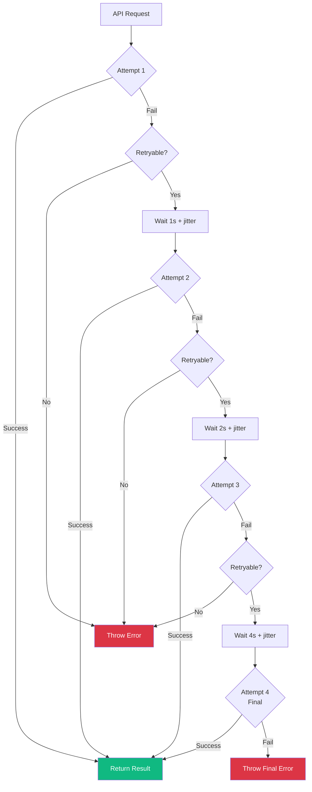

### User Isolation in Multi-Tenant Mode

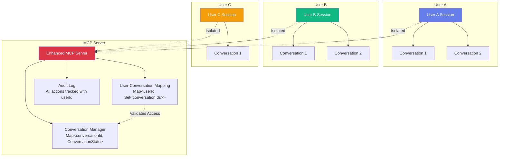

---

## Summary

This architecture provides:

1. **Flexibility**: Supports both local development (stdio) and production deployment (HTTP + OAuth)
2. **Resilience**: Circuit breaker, retry logic, and comprehensive error handling prevent cascading failures
3. **Security**: OAuth 2.0 with PKCE, session management, secret masking, and user isolation
4. **Scalability**: Multi-user support with conversation isolation and session management
5. **Observability**: Metrics, audit logs, and comprehensive logging throughout
6. **Maintainability**: Clean separation of concerns, type-safe implementation, and extensible design

The system is designed as a thin, reliable bridge between MCP clients and Copilot Studio Agents, handling the complexities of authentication, token management, and error handling while keeping the core interaction logic simple and focused.
